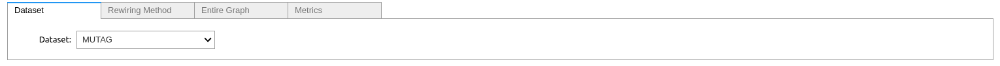

# L65-Mini-Project: Role of structural invariance in GNNs and graph transformers

Investigating what structural properties are most desirable to preserve in rewiring and positional encodings for GNNs and graph transformers


## TODO List
- [x] Generate the other metrics' Forman Curvature v2
- [ ] Generate Olivier Ricci Curvature
- [ ] Generate the original graph curvature and rewired graph curvature between sdrf, laser, borf, digl, etc


## Description

Graph rewiring techniques are used to modify the structure of graphs used to train models such as GNNs and graph transformers. However, rewiring inherently alters the structural properties of the graph, possibly distorting important structural-based information. In this paper, we offer insight in to what structural metrics are critical to remain invariant across rewiring techniques to support the future creation of effective graph rewiring methods. Our approach compares the magnitude of change in various structural metrics across six different rewiring techniques to the classification accuracy of a GNN on the rewired graphs. 

## How to play with Metric Rewiring Playground

This notebook (`Metric_Rewiring_Playground.ipynb`) is a playground for you to experiment with different rewiring techniques and see how they affect the structural properties of the graph by evaluating different spectral and spatial metrics.

**Rewiring Techniques Implemented:**
1. **SDRF** (curvature based) from *[Understanding over-squashing and bottlenecks on graphs via curvature](https://arxiv.org/abs/2111.14522)* by *Jake Topping, Francesco Di Giovanni, Benjamin Paul Chamberlain, Xiaowen Dong, Michael M. Bronstein*
2. **FOSR** (spectral based) from *[FoSR: First-order spectral rewiring for addressing oversquashing in GNNs](https://arxiv.org/abs/2210.11790)* by *Kedar Karhadkar, Pradeep Kr. Banerjee, Guido Montúfar*
3. **LASER** (local based) from *[Locality-Aware Graph-Rewiring in GNNs](https://arxiv.org/abs/2310.01668)* by *Federico Barbero, Ameya Velingker, Amin Saberi, Michael Bronstein, Francesco Di Giovanni*

4. **DIGL/PPR** (PageRank/random walked-based) from *[Diffusion Improves Graph Learning](https://arxiv.org/abs/1911.05485) by *Johannes Gasteiger, Stefan Weißenberger, Stephan Günnemann*
5. **DES** (double edge swap) from *[NetworkX](https://networkx.org/documentation/stable/reference/algorithms/generated/networkx.algorithms.swap.double_edge_swap.html)*
6. **BORF** (curvature based) from *[Revisiting Over-smoothing and Over-squashing Using Ollivier-Ricci Curvature](https://arxiv.org/abs/2211.15779)* by *Khang Nguyen, Hieu Nong, Vinh Nguyen, Nhat Ho, Stanley Osher, Tan Nguyen*
7. **DiffWire** (differential based) from *[DiffWire: Inductive Graph Rewiring via the Lovász Bound](https://arxiv.org/abs/2206.07369)* by *Adrian Arnaiz-Rodriguez, Ahmed Begga, Francisco Escolano, Nuria Oliver*
8. **GTR** (effective resistance based) from *[Understanding Oversquashing in GNNs through the Lens of Effective Resistance](https://arxiv.org/abs/2302.06835) by *Mitchell Black, Zhengchao Wan, Amir Nayyeri, Yusu Wang*

**Metrics Implemented:**
1. Effective resistance
2. Forman-Ricci curvature
3. Modularity
4. Average clustering coefficient
5. Graph Laplacian eigenvalues
6. Average Betweenness centrality
7. Diameter

**Distance Metrics Implemented:**
1. Graph Edit Distance
2. Jaccard Similarity
3. Laplacian Spectrum Distance
4. Adjacency Spectrum Distance
5. Spectral Norm of Adjacency Difference
6. Degree Distribution Distance
7. Graphlet Kernel Distance
8. Shortest Path Length Distribution Difference

**Instructions:**
Open the `Metric_Rewiring_Playground.ipynb` notebook and run the interactive widget by choosing your rewiring technique, dataset, and type of metrics.



## Automate Google Sheet Setup API Google Developer Console

Please follow the following [tutorial](https://www.geeksforgeeks.org/how-to-automate-google-sheets-with-python/) to at **least** generate your API key. The rest should be automated and ready to function in `analysis/metric_analysis.ipynb`.

✅ You are not ready to run and analyze the results of the rewiring techniques.

## Version Control Commands

To collaborate effectively and avoid conflicts while working on different parts of the project, you can use the following Git commands:

1. **Clone the repository**:
    ```sh
    git clone <repository_url>
    ```

2. **Create a new branch**:
    ```sh
    git checkout -b <branch_name>
    ```

3. **Switch to an existing branch**:
    ```sh
    git checkout <branch_name>
    ```

4. **Add changes to the staging area**:
    ```sh
    git add <file_name>
    ```

5. **Commit changes**:
    ```sh
    git commit -m "Commit message describing the changes"
    ```

6. **Pull the latest changes from the remote repository**:
    ```sh
    git pull origin <branch_name>
    ```

7. **Push changes to the remote repository**:
    ```sh
    git push origin <branch_name>
    ```

8. **Merge changes from one branch to another**:
    ```sh
    git checkout <target_branch>
    git merge <source_branch>
    ```

9. **Resolve merge conflicts**:
    - Open the conflicting files and manually resolve the conflicts.
    - Add the resolved files to the staging area:
      ```sh
      git add <resolved_file>
      ```
    - Commit the resolved changes:
      ```sh
      git commit -m "Resolved merge conflicts"
      ```

10. **Delete a branch**:
     ```sh
     git branch -d <branch_name>
     ```

11. **View the commit history**:
     ```sh
     git log
     ```
12. **View the status of the working tree**:
     ```sh
     git status
     ```
